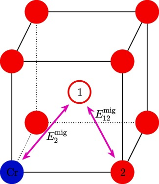
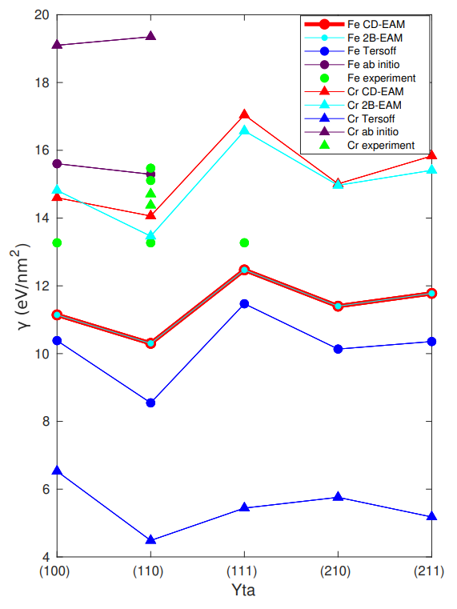

I research how particle jets' energy can be corrected for using deep learning on data from the CMS experiment at CERN. 

### Experience

- Technical student at [CERN](https://home.cern) working with Kubeflow, a cloud native service supporting scalable end-to-end machine learning pipelines
- Research assistant at [Helsinki Institute of Physics](https://hip.fi) performing graph neural network regression to improve jet energy resolution
- Full-stack developer at [Fjuul](https://fjuul.com), I worked with Node.js and Google Cloud Platform
- Research assistant at [Helsinki Accelerator Laboratory](https://helsinki.fi/en/researchgroups/helsinki-accelerator-laboratory) where we simulated iron-chromium alloys using molecular dynamics
- Further information in my [CV](assets/holmberg_daniel_cv.pdf)

### Talks

[JEC with DNN Regression](assets/slides/jec_dnn.pdf) | CMS ML Forum | Sep 2021
[Top Quark Mass Measurement](assets/slides/top_mass_das21.pdf) | CMS Data Analysis School | Jan 2021
[Atmospheric Aerosol Modeling](assets/slides/aerosol_modeling.pdf) | Data Science Project | May 2020
[Emerging Computing Architectures](assets/slides/emerging_architectures.pdf) | Distributed ML Seminar | Mar 2020
[Interatomic Potentials for Fe-Cr](assets/slides/fecr_simumeet.pdf) | Helsinki Accelerator Laboratory Simumeet | Aug 2019

### Workshops

[CMS ML Hackathon: Jet tagging](https://indico.cern.ch/event/1079395) | Kubeflow facilitator | Nov 2021
[CMS Data Analysis School at Fermilab](https://indico.cern.ch/event/966368) | Participant | Jan 2021
[First online mega-CodeRefinery](https://coderefinery.github.io/2020-05-25-online/#helpers) | Helper | May 2020

### Publications

 | **Interatomic Fe–Cr potential for modeling kinetics on Fe surfaces**   Pekko Kuopanportti, Matti Ropo, Daniel Holmberg, _et al._   _Computational Materials Science_, Volume 203, Feb 2022   [Paper](https://doi.org/10.1016/j.commatsci.2021.110840) \| [ArXiv](https://arxiv.org/abs/2105.12859)

 | **Potentialmodeller vid simulering av Fe-Cr**   Daniel Holmberg   Bachelor's Thesis, May 2019   [Paper](assets/bsc_thesis.pdf)
