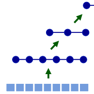
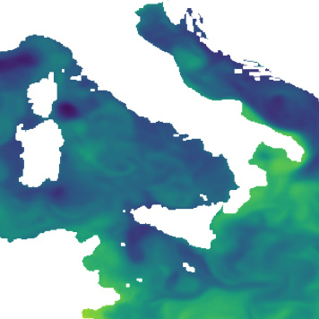
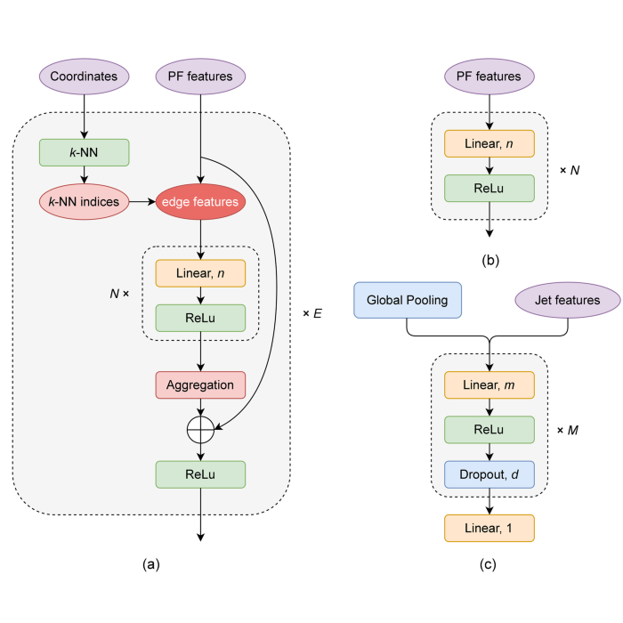

My research revolves around interdisciplary applications using structured deep learning. The main focus of my PhD is attempting to speed up space weather simulation that follows the hybrid-Vlasov formalism.

### Experience

- Visiting researcher at [CMCC](https://www.cmcc.it) building an ML based alternative to the operational numerical Mediterranean forecasting system.
- Visiting researcher at [SARAO](https://www.sarao.ac.za) developing computer vision techniques to deconvolve radio interferometric images.
- Technical student at [CERN](https://home.cern) working with Kubeflow, a cloud native service supporting scalable end-to-end machine learning pipelines.
- Further information in my [CV](assets/resume.pdf).

### Publications

 | **Accurate Mediterranean Sea forecasting via graph-based deep learning**   Daniel Holmberg, Emanuela Clementi, Italo Epicoco, Teemu Roos   _preprint_, 2025   [arxiv](https://arxiv.org/abs/2506.23900)

 | **Global fields of daily accumulation-mode particle number concentrations using in situ observations, reanalysis data and machine learning**   Aino Ovaska, Elio Rauth, Daniel Holmberg, et al.   _preprint_, 2025   [paper](https://doi.org/10.5194/ar-2025-18)

 | **Learning Developmental Age from 3D Infant Kinetics Using Adaptive Graph Neural Networks**   Daniel Holmberg, Manu Airaksinen, Viviana Marchi, Andrea Guzzetta, Anna Tuiskula, Leena Haataja, Sampsa Vanhatalo, Teemu Roos   _IEEE Transactions on Neural Systems and Rehabilitation Engineering_, 2025   [paper](https://ieeexplore.ieee.org/abstract/document/10994338) \| [arxiv](https://arxiv.org/abs/2402.14400)

 | **Regional Ocean Forecasting with Hierarchical Graph Neural Networks**   Daniel Holmberg, Emanuela Clementi, Teemu Roos   In _NeurIPS 2024 Workshop on Tackling Climate Change with Machine Learning_, 2024   [paper](https://www.climatechange.ai/papers/neurips2024/51) \| [arxiv](https://arxiv.org/abs/2410.11807) \| [slides](assets/slides/seacast_cmcc24.pdf) \| [poster](https://neurips.cc/media/PosterPDFs/NeurIPS%202024/100541.png)

 | **Jet Energy Calibration with Deep Learning as a Kubeflow Pipeline**   Daniel Holmberg, Dejan Golubovic, Henning Kirschenmann   _Computing and Software for Big Science_, Vol 7, 2023   [paper](https://doi.org/10.1007/s41781-023-00103-y) \| [arxiv](https://arxiv.org/abs/2308.12724) \| [kubecon video](https://youtu.be/iqbsbXZDjs8) \| [meetup video](https://youtu.be/AWZT9ZYgohY)

 | **Jet Energy Corrections with Graph Neural Network Regression**   Daniel Holmberg   Master's Thesis, _University of Helsinki_, 2022   [thesis](http://urn.fi/URN:NBN:fi:hulib-202205302154) \| [slides](https://indico.ijclab.in2p3.fr/event/5999/timetable/#32-jet-energy-corrections-with) \| [poster](https://indico.physik.uni-muenchen.de/event/173/contributions/862/)

 | **Interatomic Fe–Cr potential for modeling kinetics on Fe surfaces**   Pekko Kuopanportti, Matti Ropo, Daniel Holmberg, _et al._   _Computational Materials Science_, Vol 203, 2022   [paper](https://doi.org/10.1016/j.commatsci.2021.110840) \| [arxiv](https://arxiv.org/abs/2105.12859)

 | **Potentialmodeller vid simulering av Fe-Cr**   Daniel Holmberg   Bachelor's Thesis, _University of Helsinki_, May 2019   [thesis](assets/bsc_thesis.pdf) \| [slides](assets/slides/fecr_simumeet19.pdf)

### Talks

[Accurate Mediterranean Sea Forecasting via Graph-based Deep Learning](assets/slides/seacast_cmcc25.pdf) | The Way Forward Workshop: AI/ML in Earth System Science | :it:
[Regional Ocean Forecasting with Hierarchical Graph Neural Networks](assets/slides/seacast_cmcc24.pdf) | CMCC Seminar | :it:
[CERN ML Platform](https://indico.cern.ch/event/1174414/#15-cern-ml-platform) | CMG Group Meeting | :switzerland:
[Jet Energy Corrections with GNN Regression using Kubeflow at CERN](https://kccnceu2022.sched.com/event/ytqv/jet-energy-corrections-with-gnn-regression-using-kubeflow-at-cern-daniel-holmberg-dejan-golubovic-cern) | KubeCon Valencia | :es:
[Jet Energy Corrections with Graph Neural Network Regression](https://indico.ijclab.in2p3.fr/event/5999/timetable/#32-jet-energy-corrections-with) | Learning to Discover | :fr:
[Centralized Management of Your Machine Learning Lifecycle](assets/slides/kubeflow_ittf21.pdf) | CERN IT Technical Forum | :switzerland:
[Jet Energy Corrections with DNN Regression](assets/slides/jec_dnn_cms21.pdf) | CMS Machine Learning Forum | :switzerland:
[Emerging Computing Architectures](assets/slides/emerging_architectures_hu20.pdf) | Distributed ML Seminar | :finland:
[Top Quark Mass Measurement](assets/slides/top_mass_das21.pdf) | LPC CMS Data Analysis School | ㅤ
